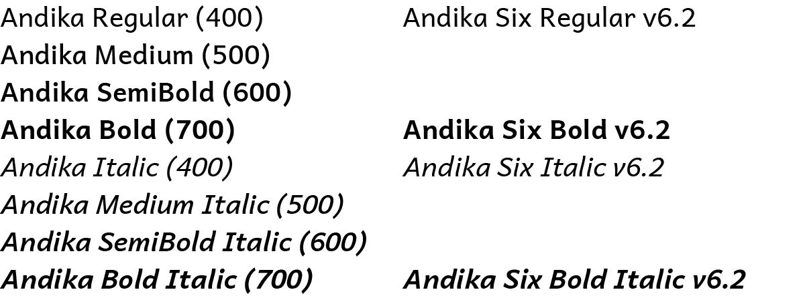
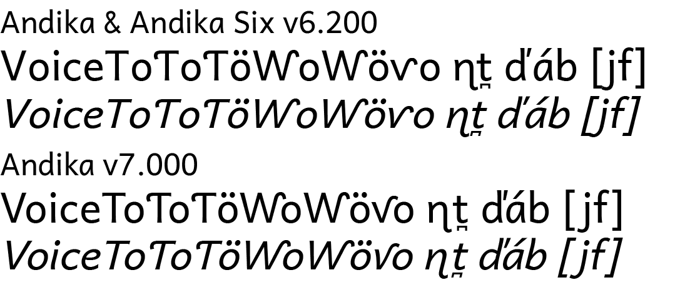

## New major release

Andika version 7 is a major release with many new additions, enhancements, and improvements. This is a summary of the most notable changes and what you need to know if you have been using earlier versions. **Please read this carefully to understand the major changes.** For further details on these changes, particularly regarding individual characters, see [Version History](history.md).

The changes in this version could have a significant effect on line, paragraph, and page lengths due to added kerning. Because of this we have released a font that reproduces the exact metrics and behavior of Andika v6.200—*Andika Six*—that can be installed at the same time as the newest Andika (v7 and beyond). Andika v7 is still the best font for most people to use. But if you have documents prepared with Andika v6.200 and need to preserve the spacing, you can install Andika Six, change the doc to use it instead of Andika, and avoid any issues with reflow. Then you can use Andika v7 for new documents and benefit from the many improvements in this and future versions. See the [Andika Six announcement](https://software.sil.org/andika/andika-six-release-6-210-a-renamed-version-of-andika-6-200/) for more details on downloading and using Andika Six.

## Family structure

### Additional intermediate weights

Andika now has additional intermediate weights. Previously existing weights have not changed. The CSS values for the weights within each family are in parentheses. Italic faces follow a similar structure and correspondence.

{.fullsize}
<!-- PRODUCT SITE IMAGE SRC https://software.sil.org/andika/wp-content/uploads/sites/19/2025/05/weights.png -->

The new intermediate weights in this extended, axis-based family can be confusing for applications that still assume families should have only four members (Regular, Italic, Bold, Bold Italic). This is the case for Microsoft Word and some older Windows applications. For details on how to use the intermediate weights in these applications, see [Using Axis-Based Font Families](https://software.sil.org/fonts/axis-based-fonts/).

### No Compact versions

The v7 fonts do not have *Compact* variants. If you need compact line spacing, and your application does not allow explicit line spacing control, you can continue to use the [v6.2 Andika Compact fonts](https://software.sil.org/lcgfonts/download/), which remain available. **If you need any of the new v7 features or characters, but also need them supported in a compact version please [contact us](https://software.sil.org/andika/about/contact/). We continue to recommend that you set line spacing explicitly in your document styles and preferences, and adjust it as needed for your particular situation.**

TypeTuner Web no longer offers line spacing alternatives for the v7 fonts (Normal, Tight, Loose). If you need Tight or Loose variants the v6.2 fonts remain available and support line spacing alternatives.

### Special-purpose modified variants have not been updated to v7

In previous versions, special-purpose modified font variants were available that had been ‘pre-tuned’ to turn on certain features by default for some regional and special uses. These are not available for the v7 fonts, however, the [v6.2 special-purpose fonts are still available](https://software.sil.org/lcgfonts/download/). **If you need any of the new features or characters in this version, but also need them supported in the special-purpose modified fonts please [contact us](https://software.sil.org/andika/about/contact/).**

Note that even in version 7, features such as character variants can be manually preset with [TypeTuner Web](https://typetunerweb.languagetechnology.org/ttw/fonts2go.cgi). The only change to this is that the 'pre-tuned' versions remain at version 6.2.

## New features and character support

### New kerning

Kerning has now been added to cover the full range of alphabetic symbols except for small caps (which will be included in a future update). To make this practically useful for a wide range of languages, the letters have been clustered into overly generalized groups. This enables the kerning to apply to more combinations, but does not allow for careful fine-tuning. The generalized kerning may not be ideal in all cases, and may still require manual adjustment, but it should provide improved spacing compared with previous versions. It is very possible that we have made some mistakes in this massive kerning effort, so please [contact us](https://software.sil.org/andika/about/contact/) if you encounter any combinations whose spacing has been made worse than in v6.2.

**Warning: Because of the addition of extensive kerning, line, paragraph, and page lengths may be different from v6.2.**

{.fullsize}
<!-- PRODUCT SITE IMAGE SRC https://software.sil.org/andika/wp-content/uploads/sites/19/2025/05/kerning.png -->

### Capital N Left Hook default changed to lowercase style

The default form for capital N with left hook has been changed to the lowercase style to match the capital Eng. The related feature (`cv44`) has been changed to substitute the uppercase style form. See the [Feature list](features.md).

### Diagonal 6 & 9 feature split into two

The OpenType feature for alternate versions of 6 and 9 with diagonal stems has been split into two separate features. The previously existing feature (`cv06`) now only affects the numeral 6. A new feature (`cv09`) affects only the numeral 9. See the [Feature list](features.md).

### Additional character support including Unicode 16

Support has been added for 29 additional characters, some of which were introduced in Unicode 16. For a full list see [Version History](history.md).

## General improvements

Other improvements have been made to over 150 glyphs, OpenType code, and other font aspects, including: 

- Letters with upper-right hooks have been redesigned to improve spacing (including kerning) and reduce collisions. Some collisions have been retained to reduce unwanted whitespace within words (e.g. ƴk).
- Central European carons have improved designs and kerning.
- Bridging diacritics handle many more possible combinations. See [Using Bridging Diacritics](https://software.sil.org/fonts/bridging-diacritics/) for details on how these need to be encoded and ordered.
- The small caps feature now affects parentheses and brackets.
- Autohinting is more consistent.

For more details see [Version History](history.md).

If you have any difficulty with these changes, or have other suggestions on how we can make the fonts better, please [contact us](https://software.sil.org/andika/about/contact/).

